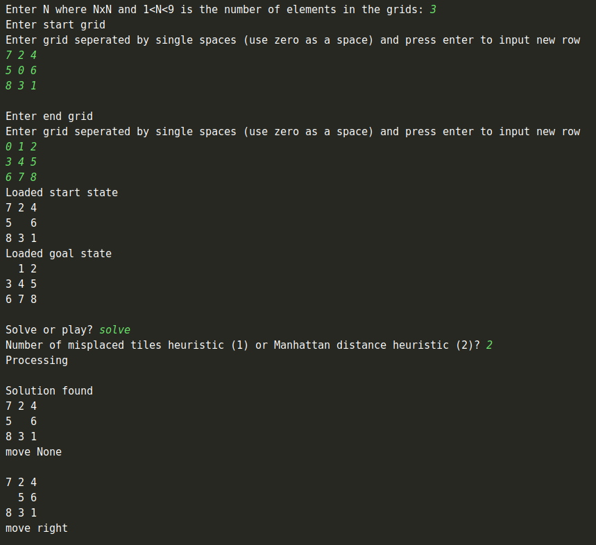

# 8-puzzle-problem-solver
Solves the 8-puzzle problem using A* search

The best moveset is listed...

## Running
`git clone https://github.com/rickybassom/8-puzzle-problem-solver.git`

`python 8_puzzle_problem.py`

Follow user input instructions to play or solve the game with a varying start state, goal state and heuristic function.
See above screenshot for example input.

## Problem Framing
Solving the problem can be framed as a state space search.

**State space** - An undirected weighted (weight of 1 for each connection) cyclic graph of nodes can represent each state of the grid configuration and how each state can move to another. It is undirected because you can undo the configuration change of the last move played. 

**Nodes** - Each node in the graph is a state of configuration of the grid.

**Arcs** - The allowed moves between every state is an up, down, left and right swipe minus the moves that don’t change the grid configuration. These are the connections between the nodes (states of the grid) in the graph.

**Problem** - (state space, start, goal condition) where the state space is a graph of every configuration of squares on a grid which will have a starting node grid configuration and a goal state which is the goal condition. The problem that has to be solved is reaching the goal condition in the state space graph from the start node. This creates a path of nodes from the start to the goal state. Only one node in the graph will satisfy the goal condition but this node can be reached in many different paths. 

**Problem solving** - This problem can be solved using graph search. The search will be to traverse the graph to find a path from the given start state to the goal state. The problem could be to: find the shortest path, the first path found goal state by the algorithm (irrespective of how many moves it took to get there) , or the cost of the path first found or of minimum length.

**Problem solution** - Will be the path of states from the start state to the goal state (a grid configuration: [[0, 1, 2], [3, 4, 5], …]). Or it could be an integer of the cost of the path (the number of moves from the start state to the end state).

## Problem solution
A* search can solve the stated graph problem. A suitable heuristic should be chosen.

### Manhattan Distance

The sum of every node’s Manhattan distance to their goal state position
Is admissible because every node’s shortest path to it’s goal position is to diagonally travel in a zig-zag pattern there, therefore this will never be an overestimate of the number of moves the player has to make. I have chosen this function in particular because I think that it will give a close estimate to the number of moves that would have to be made. The reason for not choosing euclidean distance (also admissible) is because euclidean distances will be smaller than the manhattan distance meaning that it will be a worse estimate of the number of moves to get to the goal state.

### The Number of Misplaced Tiles (tiles not in their goal state position)

This will never overestimate the path because a misplaced tile would have to at least move once to reach its goal state. I have chosen this function in particular because with a 3x3 grid the number of moves you have to make with the misplaced tiles decreases dramatically when other tiles are in the right position. If it was a larger grid this may not be suitable since the largest would still be the number of tiles on the grid (not including blank tile) even though you would have to move tiles further distances across the board.

*In both heuristics I don’t include the blank tile because you can represent the board without it and if all the tiles are in place so will the blank tile.*
